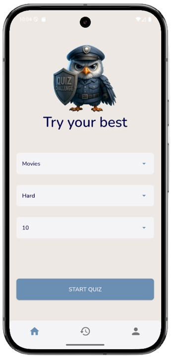
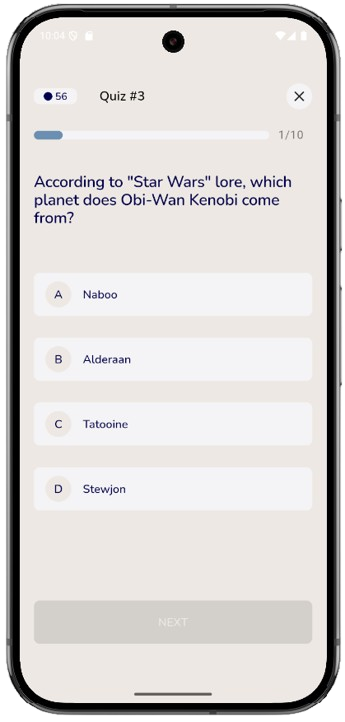
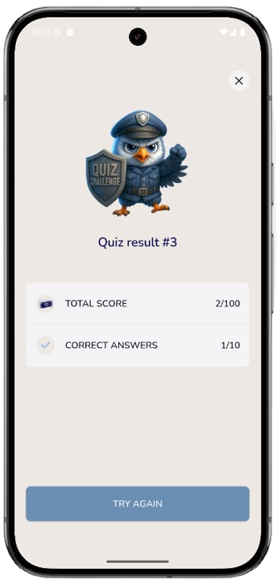

# Quiz Challenge

Este é um projeto de quiz desenvolvido em Flutter, com foco em uma arquitetura limpa e separação entre regras de negócio e UI.

Foram utilizados pacotes compatíveis com múltiplas plataformas, com o intuito de não limitar a aplicação. 


## 📋 Etapas da Elaboração do Projeto

1. **Análise Inicial**
   - Entender o desafio e seus requisitos
   - Estipular o tamanho do projeto para definir a arquitetura e o gerenciamento de estado

2. **Definição de Arquitetura**
   - Escolher a arquitetura adequada
   - Selecionar o gerenciamento de estado apropriado

3. **Planejamento Técnico**
   - Analisar e definir os pacotes externos necessários
   - Criar a estrutura de pastas do projeto

4. **Etapas iniciais com código**
   - Fork do repo principal
   - Criação do projeto
   - Criação da estrutura de pastas do projeto

5. **Desenvolvimento**
   - Fazer a transcrição do design para código (pré-layout)
   - Implementar a regra de negócio
   - Finalizar o layout fiel ao design

6. **Armazenamento de Dados**
   - Implementar o salvamento de dados local

7. **Testes e Qualidade**
   - Implementar testes automatizados
   - Realizar testes manuais
   
8. **Deploy e entrega**
  - Deploy na vercel
  - Pull no repo original na branch Desafio


## 📐 Arquitetura

**MVVM (Model - View - ViewModel)**  
**Motivo:**  
A arquitetura MVVM é ideal para aplicações pequenas como essa, pois promove a separação entre lógica de negócios e lógica de interface de usuário de forma clara e eficiente.  


## 🔄 Gerenciamento de Estado

**ChangeNotifier**  
**Motivo:**  
O `ChangeNotifier`(Provider) atende bem às necessidades de um projeto pequeno, mantendo a simplicidade sem abrir mão da capacidade de gerenciar estados de forma eficaz.


## 💾 Armazenamento de Dados

- **SharedPreferences:**  
  Utilizado para armazenar o maior score de forma simples, no formato chave-valor.

- **Drift:**  
  Escolhido como banco de dados local por ser multiplataforma, possuir suporte avançado e ser um Flutter Favorite.  
  - `sqflite`: Não é compatível com web, caso posteriormente queira rodar a aplicação da web.  
  - `sqlite3`: Não está na lista de Flutter Favorites.  
  - `Hive`: Também não é Flutter Favorite.  
  O Drift foi minha escolha para este projeto tendo análisado rápidez, status do pacote e necessidades da aplicação.
  Porém já tendo finalizado e ao testar a aplicação encontrei um problema ao rodar ele na web, então troquei pelo Hive que eu já conheço é rápido e atende bem esse desafio.


## 💬 Linguagem do Código

**Inglês**  
**Motivo:**  
Para demonstrar que posso escrever código em inglês ou português, conforme o padrão do projeto.


## 🚀 Como rodar o projeto

### ✅ Acesse online

Você pode acessar o projeto diretamente na web pelo link:  
Quiz Challenge: https://quiz-challenge-ciandt.vercel.app/

<div style="display: flex; justify-content: space-between; margin: 20px 0;">
  
  
  
</div>

### 📱 Executando localmente

Antes de executar o projeto, certifique-se de ter o Flutter instalado e configurado corretamente em seu ambiente.

1. Primeiro, instale as dependências:
```bash
flutter pub get
```

2. Escolha a plataforma desejada:

#### 🌐 Web
```bash
flutter run -d chrome
```

#### 🤖 Android 
```bash
flutter run -d android
```
*Certifique-se de ter um emulador Android rodando ou um dispositivo físico conectado via USB com o modo desenvolvedor ativado.*

#### 🍎 iOS (Não testado) <-------------------
```bash
flutter run -d ios
```
*Nota: Para executar no iOS, você precisa de um Mac com Xcode instalado e um simulador iOS configurado ou um dispositivo físico conectado.*
